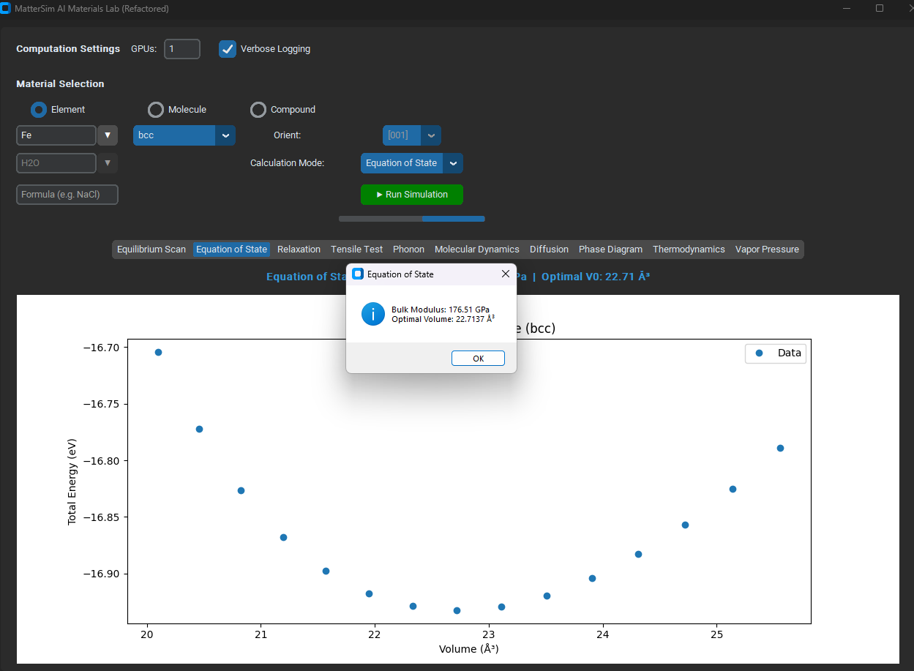
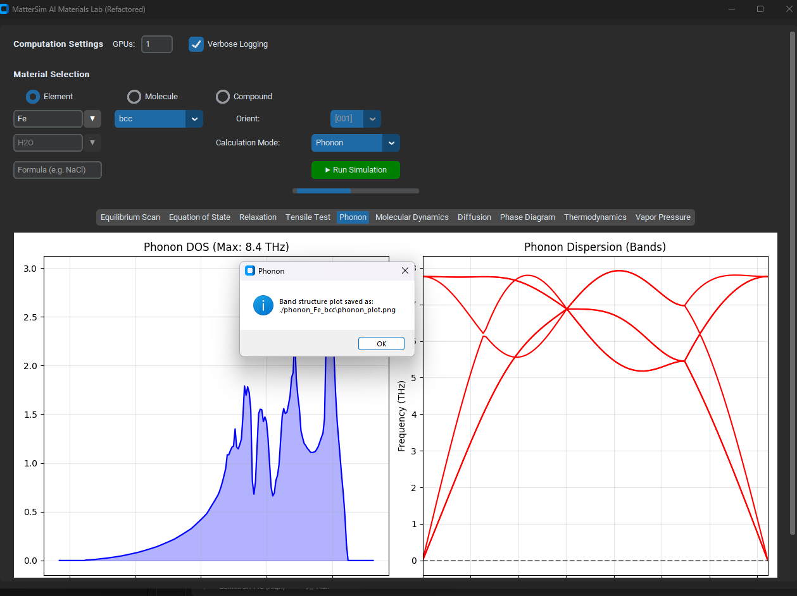
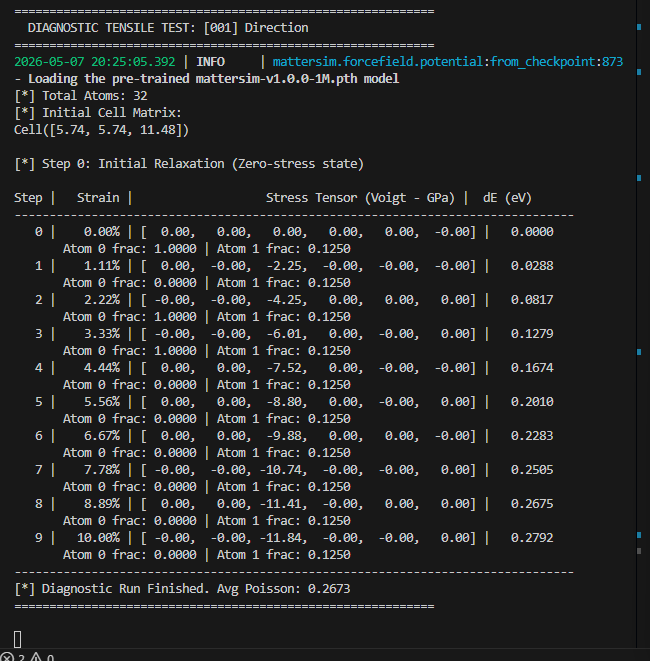
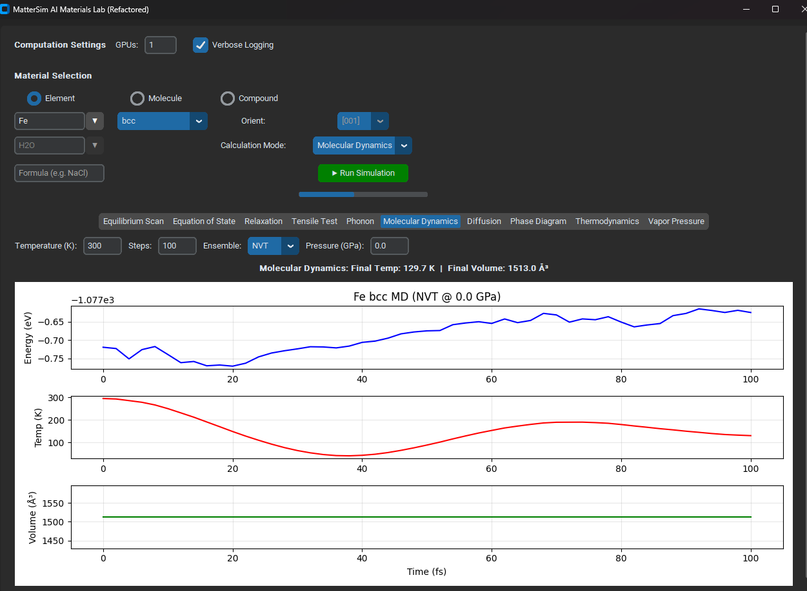
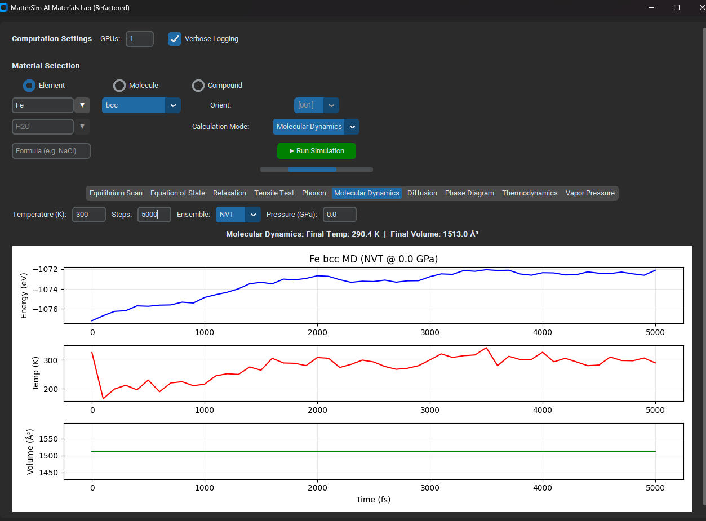

# MatterSim AI Materials Lab (v1.0.0-5M Edition)

**MatterSim AI Materials Lab** is an advanced, comprehensive graphical user interface (GUI) built with `CustomTkinter` for performing deep-learning-based atomistic and material simulations. This specific edition is upgraded to integrate and leverage the high-accuracy **MatterSim-v1.0.0-5M** pre-trained foundation model for materials.

## 🌟 Key Features

* **Advanced 5M Model Integration**: Hardcoded to utilize the high-precision `MatterSim-v1.0.0-5M.pth` model for accurate interatomic potentials via the Atomic Simulation Environment (ASE).
* **Comprehensive Simulation Suite**: Supports a wide array of simulations:
  * 👁️ **3D Structure Viewer**: Interactive visualization of conventional unit cells, molecules, and compounds.
  * 📉 **Equilibrium Scan & Equation of State (EOS)**: Analyze energy-volume relationships and bulk moduli.
  * 🛠️ **Relaxation & Tensile Tests**: Simulate structural relaxations and tensile stress-strain responses (along [001] and [111] orientations).
  * 🎶 **Phonon Analysis**: Calculate vibrational properties and detect imaginary frequencies.
  * ⚛️ **Molecular Dynamics (MD)**: Run NVT/NPT ensemble simulations to study thermal behaviors.
  * 🌡️ **Thermodynamics & Phase Diagrams**: Advanced temperature-dependent property analysis and phase stability mapping.
  * 💨 **Diffusion, Vapor Pressure, & Defect Analysis**: Evaluate complex material behaviors under varying conditions.
* **Broad Material Support**:
  * **Elements**: Automatically generates conventional unit cells for solid elements (FCC, BCC, HCP, Diamond, SC).
  * **Molecules**: Support for common stable molecules (e.g., H2O, CH4).
  * **Compounds**: Build and simulate crystal compounds using chemical formulas (e.g., NaCl, GaAs).
* **Modern & Responsive UI**: Features a sleek, dark-mode GUI built with CustomTkinter, complete with intuitive emojis, real-time Matplotlib plots, progress tracking, and multi-threaded background execution to keep the interface responsive during heavy computations.

## 📸 Screenshots & Previews

Here are some examples of the analysis and UI produced by MatterSim AI Materials Lab:

### System Data Flow

### Simulation Results

## 🚀 Getting Started

### Prerequisites
Make sure you have Python installed. You can set up the environment automatically:

1. Run `setup_environment.bat` to install all dependencies (CustomTkinter, ASE, Matplotlib, MatterSim, etc.).
2. The script will set up the necessary virtual environment.

### Launching the Application
- Run `run_app.bat` to launch the application.
- Or use `create_shortcut.bat` to add a shortcut to your desktop for easy access.

Enjoy simulating with the power of the 5M MatterSim model!
